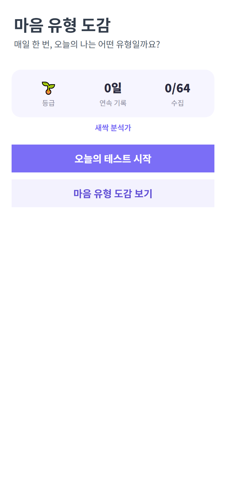
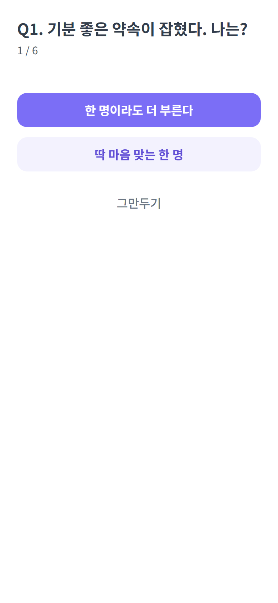
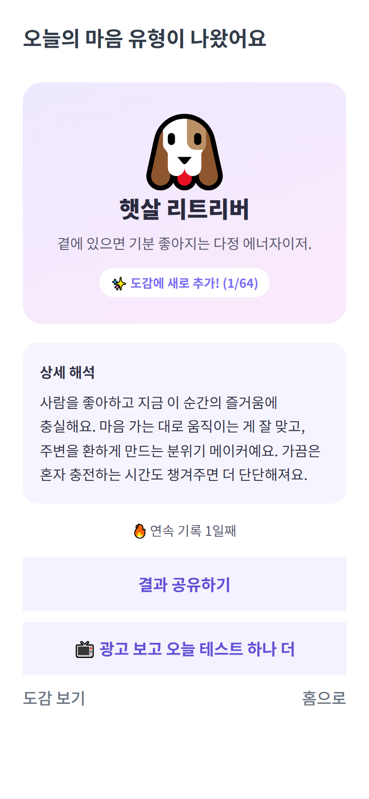
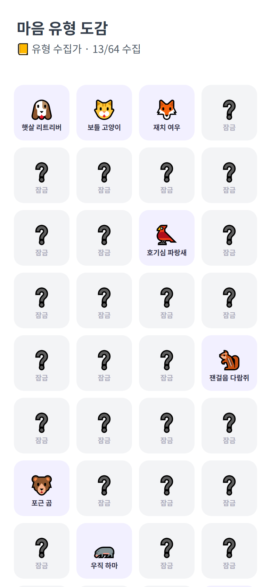
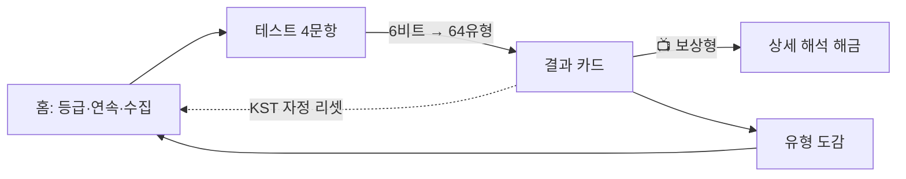

<div align="center">

# 🦉 마음 유형 도감 (Mind Type Dex)

**매일 한 번, 짧은 마음 테스트로 '오늘의 나'를 진단하고 64종 유형을 모으는 토스 미니앱**

[](https://react.dev)
[](https://www.typescriptlang.org)
[](https://vitejs.dev)
[](https://apps-in-toss.toss.im)

토스 앱 속에서 동작하는 WebView 미니앱이에요. 서버 없이(클라이언트 전용) 동작하고, 게이미피케이션 위에 보상형 광고 게이트를 얹어 수익을 내도록 설계했어요.

<br />

### 🎬 화면

| 홈 | 테스트 | 결과 | 도감 |
|:---:|:---:|:---:|:---:|
|  |  |  |  |

</div>

---

## 📑 목차
- [한눈에 보기](#-한눈에-보기) · [핵심 기능](#-핵심-기능) · [기술 스택](#-기술-스택)
- [동작 구조](#-동작-구조) · [엔지니어링 하이라이트](#-엔지니어링-하이라이트) · [로컬 실행](#-로컬-실행) · [구조](#-프로젝트-구조) · [로드맵](#-로드맵)

---

## 🎯 한눈에 보기

> 오늘의 테스트 → 유형 카드 생성 → 도감 수집 → 연속 기록 → 다음날 복귀. 그 사이사이에 **선택형 보상형 광고**로 상세 해석을 해금해요.

| | |
|---|---|
| **무엇을** | 매일 6문항에 답해 64종 '마음 유형' 중 오늘의 나를 진단하고 수집하는 비게임 콘텐츠 |
| **어디서** | 토스 앱 내 미니앱 (3,000만 토스 유저 노출) |
| **누구를 위해** | 가볍게 자기 이해·취향 탐색을 즐기는 성인 사용자 |
| **누가** | 1인 기획·개발 (프론트엔드 + 콘텐츠 설계 + 광고 경제 설계 + 출시 정책) |

---

## ✨ 핵심 기능
- **비게임 코어 — 심리/취향 진단** : 6개 이분 축(에너지·결정·리듬·시선·도전·표현)에 답하면 6비트 → 64종 유형으로 **결정적 매핑**. 점수·승패가 없어 게임이 아닌 콘텐츠예요.
- **유형 도감 수집** : 매일 달라지는 결과를 모아 64칸을 채우고, 새싹 분석가 → 마음 박사까지 등급이 올라가요.
- **연속 기록(streak)** : KST 자정 기준 일일 리셋. 끊길 위기엔 `광고 보고 연속 기록 지키기`로 복구.
- **선택형 광고 게이트** : `상세 해석 해금`·`오늘 하나 더`·`연속 지키기`를 보상형 광고로. 모두 **결정적 보상**(확률·뽑기 없음)이라 사행성 표면이 없어요.
- **공유 카드** : 오늘의 유형을 `getTossShareLink` + `share`로 친구에게 자랑.

---

## 🛠 기술 스택

| 영역 | 사용 기술 |
|---|---|
| **언어** | TypeScript 5.7 (strict) |
| **프론트엔드** | React 18, Vite 6 |
| **디자인 시스템** | TDS Mobile (토스 디자인 시스템) |
| **플랫폼 SDK** | `@apps-in-toss/web-framework` (Granite 런타임 · WebView 브릿지 · 인앱광고 · 서버시간 · 공유 · 알림동의) |
| **상태** | localStorage (서버 없는 클라이언트 전용) |
| **수익화** | 인앱 광고(보상형·전면·배너) — 게이미피케이션 기반 자발적 노출 |
| **품질** | ESLint(flat config), Prettier, Playwright(전 화면 스크린샷 회귀) |
| **배포** | `ait build` → `.ait` 아티팩트 → `ait deploy` |

---

## 🧭 동작 구조

서버가 없어 모든 상태는 **클라이언트 상태 머신 + localStorage**로 관리해요. 화면은 `home → test → result → dex` 4개를 단일 `view` 상태로 전환하고, 토스 네이티브 뒤로가기를 인앱 라우팅에 연결했어요. 일일 리셋·연속 기록 판정만 **토스 서버 시각(`getServerTime`)** 을 KST로 보정해 쓰고, 미지원 환경에선 기기 시각으로 폴백해요(클라 시계 단독 신뢰 회피).



---

## 💡 엔지니어링 하이라이트

<details open>
<summary><b>1. 사행성 없는 광고 경제 — 결정적 보상만</b></summary>

> 광고 게이트를 전부 "결정적 보상"으로 설계했어요. `광고 보고 상세 해석 해금`, `오늘 테스트 하나 더`, `연속 기록 지키기` — 광고가 확정된 가치를 주고, 확률 상승·리롤·랜덤 상자 같은 시뮬레이션 도박 요소를 0으로 뒀어요. 유형도 랜덤 뽑기가 아니라 답변 4비트로 정해지는 진단 결과라, 수집의 재미를 주면서도 등급분류·사행성 심사 리스크를 피했어요.
</details>

<details>
<summary><b>2. 비게임으로 설계한 '게임 같은' 루프</b></summary>

> 도감 수집·연속 기록·등급·공유는 전형적인 게이미피케이션이지만, 코어 동사를 '진단/생성/수집'으로 잡아 게임 카테고리(등급분류 → 출시 지연)를 회피했어요. 승패·점수경쟁·실시간 조작이 코어가 아니라 부가 레이어로만 작동하도록 경계를 그었어요.
</details>

<details>
<summary><b>3. 그레이스풀 디그레이데이션</b></summary>

> 광고 그룹 ID가 비어 있어도(`isSupported()` 가드 + 빈 키 즉시 통과) 브라우저 '둘러보기'에서 흐름이 끊기지 않아요. 덕분에 광고 SDK 없이도 로컬에서 전 화면을 Playwright로 자동 캡처·회귀 검증할 수 있어요.
</details>

<details>
<summary><b>4. 로그인 없는 최소 수집 설계</b></summary>

> 토스 로그인을 쓰지 않고 익명/로컬로만 동작해요. 이름 외 추가 개인정보를 받지 않으니 회원탈퇴(연결끊기) 서버 엔드포인트 구현 부담이 사라지고, 출시 경로가 가장 짧아요. 친구 비교는 실시간 리더보드 대신 공유 카드로 대체했어요.
</details>

---

## 🚀 로컬 실행

```bash
npm install
cp .env.example .env   # 값은 비워둬도 '둘러보기'로 흐름 확인 가능
npm run dev
```
```bash
npm run build   # vite/ait 빌드 → .ait 아티팩트
npm run deploy  # 앱인토스 콘솔로 배포
```
광고/알림 키는 앱인토스 콘솔에서 발급해 `.env`에 넣으면 실광고가 렌더돼요(실광고는 토스 앱/샌드박스에서만 표시).

---

## 📂 프로젝트 구조

```
src/
├─ lib/         env · analytics · tossEnv · dateKey(KST 서버시각)
├─ hooks/       useAdGate · useInterstitialAd · useDexState(수집·연속·해금)
├─ components/  BannerAd (화면당 1개)
├─ data/        types(64유형·문항·매핑) · share · notify
├─ screens/     Home · Test · Result · Dex
└─ App.tsx      view 상태 머신 + 토스 back 이벤트 연결
scripts/        Playwright 전 화면 스크린샷
submission/     심사용 앱정보(docx) · 아이콘 600 · 썸네일 1932×828
```

---

## 🗺 로드맵
- [ ] 광고 그룹 ID 연결 → 수익화 활성화
- [ ] 데일리 리마인드 푸시(스마트 발송) 템플릿 연동
- [ ] 유형 카드 코스메틱 테마 추가
- [ ] 지표 안정화 후 토스포인트 보상 도입(서버 검증·중복지급 방지)

---

<div align="center">

**개인 포트폴리오 목적으로 공개한 저장소예요.**
앱인토스 미니앱 · 비게임 게이미피케이션 · 광고 경제 · 출시 정책까지 1인 개발한 사례로 봐주세요. 🦉

</div>
